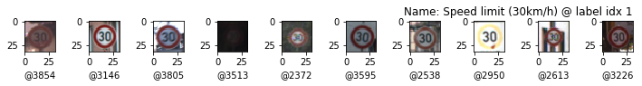
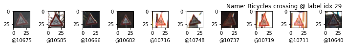
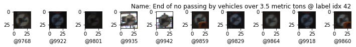

# **Traffic Sign Recognition** 

> Jupyter Notebook project to explore the topic of Neural Networks by buildng a Traffic Sign Recognition NN. This project is created as one possible solution to the third project of Udacity's Nano Degree Self Driving Car Engineer in the School of Autonomous Systems.

## Goal

The goals / steps of this project are the following:
* Load the data set (see below for links to the project data set)
* Explore, summarize and visualize the data set
* Design, train and test a model architecture
* Use the model to make predictions on new images
* Analyze the softmax probabilities of the new images
* Summarize the results with a written report

#### 1. Provide a Writeup / README that includes all the rubric points and how you addressed each one. You can submit your writeup as markdown or pdf. You can use this template as a guide for writing the report. The submission includes the project code.

You're reading it! and here is a link to my [project code](https://github.com/joustava/CarND-Traffic-Sign-Classifier-Project/blob/main/Traffic_Sign_Classifier_Acc95_latest.ipynb)

### Data Set Summary & Exploration

#### 1. Provide a basic summary of the data set. In the code, the analysis should be done using python, numpy and/or pandas methods rather than hardcoding results manually.

I used the pandas library to calculate summary statistics of the traffic
signs data set:

* The size of training set is 34799
* The size of the validation set is 4410
* The size of test set is 12630
* The shape of a traffic sign image is (32, 32)
* The number of unique classes/labels in the data set is 43

#### 2. Include an exploratory visualization of the dataset.

Here is an exploratory visualization of the data set. The first exploration is a bar chart showing how the amount of each label per dataset.

This chart shows that the datasets are split accordingly howerer each dataset has skewed data where some labels
are not very well presented. This most probably will result in the network favouring certain predictions over others.

Included are also 10 randomly chosen images per known label to check what kind of data we need to work with.

| Random set of 10 images per label | Random set of 10 images per label |
|:---------------------------------------------:|:----------------------------------------------|
|  |  |
|  |  |
|  |  |
|  |  |
|  |  |
|  |  |
|  |  |
|  |  |
|  |  |
|  |  |
|  |  |
|  |  |
|  |  |
|  |  |
|  |  |
|  |  |
|  |  |
|  |  |
|  |  |
|  |  |
|  |  |
|  | |

From these we can see that there is a wide range of lighting and image quality. There even are images that are very dark.
### Design and Test a Model Architecture

#### 1. Describe how you preprocessed the image data.

The preprocessing step includes grayscaling as this improves performance time wise and memory wise as the network only needs to check one layer per image. The images are also normalized. The following images show the before and after state when processing one image.

#### 2. Describe what your final model architecture looks like including model type, layers, layer sizes, connectivity, etc.) Consider including a diagram and/or table describing the final model.

My final model consisted of the following layers:

| Layer         		    | Description	        					                | In -> Out       |
|:---------------------:|:---------------------------------------------:|:---------------:|
| Input         		    | 32x32x1 Grayscale image   							      | -               |
| Convolution 1 (3x3)  	| 1x1 stride, valid padding  	                  | (?, 32, 32, 1) -> (?, 30, 30, 16) |
| RELU Activation	1			|												                        | -                |
| Pooling 1 	          | max, 2x2 stride, valid padding               	| (?, 30, 30, 16) -> (?, 15, 15, 16) |
| Convolution 2 (3x3)  	| 1x1 stride, valid padding  	                  | (?, 15, 15, 16) -> (?, 13, 13, 64) |
| RELU Activation	2			|												                        | - |
| Pooling 2 	          | max, 2x2 stride, valid padding               	| (?, 13, 13, 64) -> (?, 6, 6, 64) |
| Convolution 3 (3x3)  	| 1x1 stride, valid padding  	                  | (?, 6, 6, 64) -> (?, 4, 4, 256) |
| RELU Activation	3			|												                        | - |
| Pooling 3 	          | max, 2x2 stride, valid padding               	| (?, 4, 4, 256) -> (?, 2, 2, 256) |
|	Flatten               |             					|												| (?, 2, 2, 256) -> (?, 1024) |
| Fully connected 1		  |         									                    | (?, 1024) -> (?, 120) |
| RELU Activation	4			|												                        | -                |
| Dropout	1			        | keep 0.5  					                          | -                   |
| Fully connected	2     | Output with size of known labels              | (?, 120) -> (?, 43) |
| RELU Activation	5			|												                        | -                   |

#### 3. Describe how you trained your model

First I build the network similar to the LeNet network and chose initially to train the model with proposed starting settings

* 0.0001 as learning rate
* 0.5 keep probability
* 128 batch size
* 50 epochs

and ended up using

* 0.0005 as learning rate
* 0.5 keep probability
* 2056 batch size
* 45 epochs

Changing these settings with the LeNet implementation did not improve the accuracy.  

#### 4. Describe the approach taken for finding a solution and getting the validation set accuracy to be at least 0.93.

> Accuracies based on the model saved in ./models/traffic-sign-model2.ckpt

My final model results were:

* training set accuracy 0.999
* validation set accuracy 0.952
* test set accuracy 0.947

A few iterations of learning showed that the network could not get higher than around 90% accuracy.
Adding extra fully connected layers brought the accuracy down, this also happend when adding normalization layers
between the fully connected layers. Also dropout layers didn't seem to do much between the Convolutional Layers, an approach I tried based on reading where such layers can give some performance boost s long as the dropout rate is kept low.

I then decided to strech out the convolutional layers to include one extra layer by reducing the kernel sizes to 3x3 and giving them all Relu activation functions and Pool their output with 2x2 kernels and strides of 1x1. This somewhat (~2%) improved the accuracy but this was not enough. I decided to augment the data set 

### Test a Model on New Images

#### 1. Choose five German traffic signs found on the web and provide them in the report. For each image, discuss what quality or qualities might be difficult to classify.

Here are five German traffic signs that I found on the web all downloaded via my shutterstock account.

| Image | details |
|:-----:|:--------|
| ![Bump sign][./web/download1.jpeg] | Is blurry, icons inside might make give a prediction for similar shaped sign |
| ![Stop sign][./web/download2.jpeg] | Is covered with stickers but should predicted correctly |
| ![End sign][./web/download3.jpeg]  | This sign is rather clear and should be easy to predict |
| ![130 sign][./web/download4.jpeg]  | The network does not know about this particular sign as it is a newer 130 km/h sign. The network should predict a same type.
| ![Priority sign][./web/download5.jpeg] | Is an sign from a distance and might not have enough data for good prediction |

I expected the first three images to be classified correctly. The fourth I expected to be classified as on of the other maximum speed sign, I chose this sign to see its behaviour on images that are close to data in the training set. The last, which I purposefully did not crop to the borders of the sign, I did not expect to be classified correctly at all.

#### 2. Discuss the model's predictions on these new traffic signs and compare the results to predicting on the test set.

Here are the results of the prediction:

| Image             | Prediction   |
|:--------------------:|:-------------:|
| Bumpy Road           | Slippery road |
| Stop Sign            | Stop sign    |
| End all              | Wild animals crossing |
| Speed Limit 130 km/h | Road work |
| Priority road        | Yield |

The model was able to correctly guess 4 of the 5 traffic signs, which gives an accuracy of 80%. This compares favorably to the accuracy on the test set of ...

#### 3. Describe how certain the model is when predicting on each of the five new images by looking at the softmax probabilities for each prediction. Provide the top 5 softmax probabilities for each image along with the sign type of each probability. (OPTIONAL: as described in the "Stand Out Suggestions" part of the rubric, visualizations can also be provided such as bar charts)

The code for making predictions on my final model is located in the 11th cell of the Ipython notebook.

##### Bumpy road (label 22)

For the Bumpy road (label 22) image, the model is very sure that this is a slippery road sign (probability of 0.999), however this does not match the actual sign and probably due to the quality of the image other sign probabilities are not even concidered.

| Probability | Prediction                               | Label |
|:-----------:|:----------------------------------------:|:--:|
| 0.999       | Slippery road                            | 23 |
| 0.0         | Dangerous curve to the right             | 20 |
| 0.0         | Beware of ice/snow                       | 30 |
| 0.0         | Vehicles over 3.5 metric tons prohibited | 16 |
| 0.0         | No passing                               | 9  |

##### Stop sign (label 14)

For the stop sign (label 14) image, again the model is very sure it actually is the stop sign even though the 
sign is covered with stickers. My hypothesis is that this sign has edges that are very distinctive and thus the 
model can detect these well.

| Probability | Prediction| Label |
|:-----------:|:---------:|:------| 
| 0.976 | Stop | 14 |
| 0.013 | Traffic signals | 26 |
| 0.005 | General caution | 18 |
| 0.002 | Road work | 25 |
| 0.0 | Bicycles crossing | 29 |

##### Speed limit - 130km/h (label x)

The 130km/h speed limit sign is wrongly predicted to be a wild animals crossing. This time there are other
signs concidered in the top five. Among the predictions is speed limit 30km/h which is visually very close.
Also other speed signs are concidered. Of course the 130 km/h is not in the test set and the model does not know about it. Even though it conciders other similar signs it predicts it as wild animals which is completely off.

| Probability | Prediction| Label |
|:-----------:|:---------:|:------| 
| 0.729 | Wild animals crossing | 31 |
| 0.187 | Speed limit (50km/h) | 2 |
| 0.082 | Speed limit (60km/h) | 3 |
| 0.0 | Speed limit (30km/h) | 1 |
| 0.0 | Slippery road | 23 |

##### End of all speed and passing limits (label 32)

This sign is also predicted wrong. This time the second best guess is the correct one. I suspect that the model
is biased to triangular signs as even with the previous speed limit image it predicts a sign which is not round.

End of all speed and passing limits 32
| Probability | Prediction| Label |
|:-----------:|:---------:|:------| 
| 0.969 | Road work | 25 |
| 0.03 | End of all speed and passing limits | 32 |
| 0.0 | Traffic signals | 26 |
| 0.0 | Keep left | 39 |
| 0.0 | End of speed limit (80km/h) | 6 |

##### Priority road (label 12)

The last also is a false prediction. In the top five again the correct sign is listed. In this case the model is not sure but again the two most probable are triangular signs.

| Probability | Prediction| Label |
|:-----------:|:---------:|:------| 
| 0.487 | Yield | 13 |
| 0.46 | Road work | 25 |
| 0.027 | Priority road | 12 |
| 0.014 | Speed limit (70km/h) | 4 |
| 0.004 | Road narrows on the right | 24 |

According to these outcomes it seems that the model is very biased toward triangular signs. Even though the test data was augmented, the augmentation only makes the set 4 times bigger and thus the data is still skewed. Upon deeper inspection of the data it can been seen that triangular signs and round (with red edges) take op most of the set (~35 labels) Thus it is no surprise the model has a prediction preference.

### (Optional) Visualizing the Neural Network (See Step 4 of the Ipython notebook for more details)
#### 1. Discuss the visual output of your trained network's feature maps. What characteristics did the neural network use to make classifications?

-
