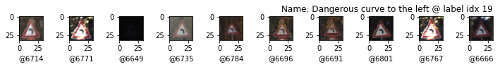
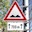

# Traffic Sign Recognition

> Jupyter Notebook project to explore the topic of Neural Networks by buildng a Traffic Sign Recognition NN. This project is created as one possible solution to the third project of Udacity's Nano Degree Self Driving Car Engineer in the School of Autonomous Systems.

## Goal

The goals / steps of this project are the following:

* Load the data set (see below for links to the project data set)
* Explore, summarize and visualize the data set
* Design, train and test a model architecture
* Use the model to make predictions on new images
* Analyze the softmax probabilities of the new images
* Summarize the results with a written report

You're reading the report atm! Here is a link to my final [project code](https://github.com/joustava/CarND-Traffic-Sign-Classifier-Project/blob/main/Traffic_Sign_Classifier_model_5.ipynb)

This repository contains a few more notebooks and links to them that cover certain versions of the model used in this writeup.
Most of the writeup pertains to the latest version linked to previsouly. I'll refer to older versions when needed, e.g to cover improvements and comparisons.

## Exploratory Data Analysis

### 1. Provide a basic summary of the data set. In the code, the analysis should be done using python, numpy and/or pandas methods rather than hardcoding results manually.

I used the numpy library to calculate summary statistics of the traffic
signs data set:

* The size of training set is 34799
* The size of the validation set is 4410
* The size of test set is 12630
* The shape of a traffic sign image is (32, 32, 3)
* The number of unique classes/labels in the data set is 43

#### 2. Include an exploratory visualization of the dataset

Here is an exploratory visualization of the data set. The first exploration is a bar chart showing how the amount of each label per dataset.

This chart shows that the datasets are split accordingly however, each dataset has skewed data where some labels
are not very well presented. This most probably will result in the network favouring certain predictions over others.

Included are also 10 randomly chosen images per known label to check what kind of data we need to work with.

| Random set of 10 images per label | Random set of 10 images per label |
|:---------------------------------------------:|:----------------------------------------------|
|  |  |
|  |  |
|  |  |
|  |  |
|  |  |
|  |  |
|  |  |
|  |  |
|  |  |
|  |  |
|  |  |
|  |  |
|  |  |
|  |  |
|  |  |
|  |  |
|  |  |
|  |  |
|  |  |
|  |  |
|  |  |
|  | |

From these we can see that there is a wide range of lighting and image quality. There even are images that are very dark. Also, we can see that triangular signs are over represented with regards to the data set.

### Design and Test a Model Architecture

#### 1. Describe how you preprocessed the image data

The preprocessing step includes grayscaling as this improves performance time wise and memory wise as the network only needs to check one layer per image. The images are also normalized. The following images show the before and after state when processing one image.

Grayscaling was chosen as it gave better results on average than RGB images according to the [Traffic Sign Recognition with Multi-Scale Convolutional Networks](http://yann.lecun.com/exdb/publis/pdf/sermanet-ijcnn-11.pdf) by Yann LeCun, the original creator of the LeNet architecture.

Until **model 4** and [Traffic_Sign_Classifier_model_4.ipynb]([notebook](https://github.com/joustava/CarND-Traffic-Sign-Classifier-Project/blob/main/Traffic_Sign_Classifier_model_4.ipynb))

#### 2. Describe what your final model architecture looks like including model type, layers, layer sizes, connectivity, etc.) Consider including a diagram and/or table describing the final model.

My final model consisted of the following layers:

| Layer         		    | Description	        					                | In -> Out       |
|:---------------------:|:---------------------------------------------:|:---------------:|
| Input         		    | 32x32x1 Grayscale image   							      | -               |
| Convolution 1 (3x3)  	| 1x1 stride, valid padding  	                  | (?, 32, 32, 1) -> (?, 30, 30, 16) |
| RELU Activation	1			|												                        | -                |
| Pooling 1 	          | max, 2x2 stride, valid padding               	| (?, 30, 30, 16) -> (?, 15, 15, 16) |
| Convolution 2 (3x3)  	| 1x1 stride, valid padding  	                  | (?, 15, 15, 16) -> (?, 13, 13, 64) |
| RELU Activation	2			|												                        | - |
| Pooling 2 	          | max, 2x2 stride, valid padding               	| (?, 13, 13, 64) -> (?, 6, 6, 64) |
| Convolution 3 (3x3)  	| 1x1 stride, valid padding  	                  | (?, 6, 6, 64) -> (?, 4, 4, 256) |
| RELU Activation	3			|												                        | - |
| Pooling 3 	          | max, 2x2 stride, valid padding               	| (?, 4, 4, 256) -> (?, 2, 2, 256) |
|	Flatten               |             					|												| (?, 2, 2, 256) -> (?, 1024) |
| Fully connected 1		  |         									                    | (?, 1024) -> (?, 120) |
| RELU Activation	4			|												                        | -                |
| Dropout	1			        | keep 0.5  					                          | -                   |
| Fully connected	2     | Output with size of known labels              | (?, 120) -> (?, 43) |
| RELU Activation	5			|												                        | -                   |

The details in the images are very sublte and adding a Convolutional layer will give the network more space for recognizing features. The count of Fully connected layers was kept to two as adding more did not seem to have the disired effect of improving the accuracy. The first iterations started to fluctuate around certain accuracies from epoch ~15 onwards which can be an indication of overfitting. The added dropout layer improved overfitting and the accuracy slightly fluctuates in the last 10 or so epochs which can also be attributed to the randomnes of batched data. 
#### 3. Describe how you trained your model

First I build the network similar to the LeNet network and chose initially to train the model with proposed starting settings

* 0.0001 as learning rate
* 0.5 keep probability
* 128 batch size
* 50 epochs

Changing these settings with the LeNet implementation did not improve the accuracy and mostly worsened them.
I ended up modifying the Lenet architecture and applied the following settings

* 0.001 as learning rate (Default of the AdamOptimizer)
* 0.5 keep probability
* 1024 batch size
* 50 epochs

The initial learning rate is adapted by the AdamOptimizer throughout the learning process for each Weight in the network.
#### 4. Describe the approach taken for finding a solution and getting the validation set accuracy to be at least 0.93.

A few iterations of training showed that the initial (LeNet) network could not get higher than around 90% accuracy.
Adding extra fully connected layers brought the accuracy down, this also happend when adding normalization layers
between the fully connected layers. Also dropout layers didn't seem to do much between the Convolutional Layers, an approach I tried based on reading where such layers can give some performance boost as long as the dropout rate is kept low.

I then decided to strech out the convolutional layers to include one extra layer by reducing the kernel sizes to 3x3 and giving them all Relu activation functions and Pool their output with 2x2 kernels and strides of 1x1. This somewhat (~2%) improved the accuracy but this was not enough.

Next I applied data augmentation by duplicating it twice, once with slightly clockwise rotated images and another with anti-clockwise rotated images.

On this architecture I tried also leaky Relu's in the place of the Relu's, this brought down the accuracy but it might be related to other settings I needed to tweak, I undid the change.

The first iterations started to fluctuate around certain accuracies from epoch ~15 onwards which can be an indication of overfitting and thus I added a dropout layer as remedy. This then resulted in

> Accuracies based on the model saved in ./models/traffic-sign-model2.ckpt and was ran within [Traffic_Sign_Classifier_model_2.ipynb](https://github.com/joustava/CarND-Traffic-Sign-Classifier-Project/blob/main/Traffic_Sign_Classifier_model_2.ipynb)

* training set accuracy 0.999
* validation set accuracy 0.952
* test set accuracy 0.947

Initially an AdamOptimizer was used configured with a low learning rate of 0.0001 instead of the default 0.001. The default setting is sufficient in this network and together with a lower batch size of 1024 raised the accuracy by ~1.5% and gave the following accuracies:

> Accuracies based on the model saved in ./models/traffic-sign-model4.ckpt and was ran within [Traffic_Sign_Classifier_model_4.ipynb](https://github.com/joustava/CarND-Traffic-Sign-Classifier-Project/blob/main/Traffic_Sign_Classifier_model_4.ipynb)

* training set accuracy 0.999
* validation set accuracy 0.970
* test set accuracy 0.957

### Test a Model on New Images

#### 1. Choose five German traffic signs found on the web and provide them in the report. For each image, discuss what quality or qualities might be difficult to classify

Here are five German traffic signs that I found on the web all downloaded via my Shutterstock account.

| Image | Name | details |
|:-----:|:------:|:--------:|
|  | Speed Bump | Has extra information in the form of a sub sign, small icons inside are not clear, prediction could be for similar shaped sign |
|  | Stop | Is covered with stickers but should predicted correctly |
|   | End of... | This sign is rather clear and should be easy to predict |
|   | Speed limit 130km/h | The network does not know about this particular sign as it is a newer 130 km/h sign. The network should predict a same type.
|  | Priority road | Is a sign from a distance and might not have enough data for good prediction |

Before experimenting I expected the first three images to be classified correctly. The fourth I expected to be classified as on of the other maximum speed sign, I chose this sign to see its behaviour on images that are close to data in the training set. The last, which I purposefully did not crop to the borders of the sign, I did not expect to be classified correctly at all.

#### 2. Discuss the model's predictions on these new traffic signs and compare the results to predicting on the test set

The **model 4** was able to correctly predict 1 of the 5 traffic signs and gave an accuracy of 20% compared to a testing accuracy of ~97%. Two of the images
in the custom set, the `Speed limit 130km/h` and `Priority road` were expected to be falsely predicted as the first does not exist in the test set and the second is not of good quality for the model. However the model did list the correct label in the top 5 softmaxes for 4 of the images. Keeping the low quality of the images in mind an accuracy 0f 20% is good.

> Predictions based on the model saved in ./models/traffic-sign-model2.ckpt and ran in [Traffic_Sign_Classifier_model_2.ipynb](https://github.com/joustava/CarND-Traffic-Sign-Classifier-Project/blob/main/Traffic_Sign_Classifier_model_2.ipynb)

| Image             | Prediction   |
|:--------------------:|:-------------:|
| Bumpy Road           | Slippery road |
| Stop Sign            | Stop sign    |
| End all              | Wild animals crossing |
| Speed Limit 130 km/h | Road work |
| Priority road        | Yield |

The improvements in test/validation accuracy in **model 4** increased the accuracy to 0.4 and made 2 correct predictions

> Predictions based on the model saved in ./models/traffic-sign-model4.ckpt and ran in [Traffic_Sign_Classifier_model_4.ipynb](https://github.com/joustava/CarND-Traffic-Sign-Classifier-Project/blob/main/Traffic_Sign_Classifier_model_4.ipynb)

| Image             | Prediction   |
|:--------------------:|:-------------:|
| Bumpy Road           | No passing |
| Stop Sign            | Stop    |
| End all              | End of all speed and passing limits |
| Speed Limit 130 km/h | Speed limit (50km/h) |
| Priority road        | Yield |

This is twice as good as model 2.

#### 3. Describe how certain the model is when predicting on each of the five new images

The code for making predictions on my final model is located in the last cell of the Ipython notebook.

##### Bumpy road (label 22)

For the Bumpy road (label 22) image, **model 4** is very sure that this is a `No passing` sign (probability of 0.995), however this does not match the actual sign and probably due to the quality of the icon on the sign other signs are concidered.

| Probability | Prediction| Label |
|:-----------:|:---------:|:------| 
| 0.995 | No passing | 9 |
| 0.004 | Slippery road | 23 |
| 0.0 | Turn left ahead | 34 |
| 0.0 | Speed limit (60km/h) | 3 |
| 0.0 | Keep right | 38 |

##### Stop sign (label 14)

For the stop sign (label 14) image, again **model 4** is very sure it actually is the stop sign even though the 
sign is covered with stickers. My hypothesis is that this sign has edges that are very distinctive and thus the 
model can detect these well.

| Probability | Prediction| Label |
|:-----------:|:---------:|:------| 
| 0.999 | Stop | 14 |
| 0.0 | Yield | 13 |
| 0.0 | Speed limit (70km/h) | 4 |
| 0.0 | Speed limit (30km/h) | 1 |
| 0.0 | Road work | 25 |

##### Speed limit - 130km/h (label x)

The 130km/h speed limit sign is 'wrongly' predicted to be a `Speed limit (50km/h)` by **model 4**. Among the predictions is `Speed limit (60km/h)` which is visually very close. Also other speed signs are concidered. Of course a `Speed limit (130km/h)` not in the test set and the model does not know about it, thus ths is expected.

| Probability | Prediction| Label |
|:-----------:|:---------:|:------| 
| 0.997 | Speed limit (50km/h) | 2 |
| 0.001 | No passing | 9 |
| 0.0 | Speed limit (60km/h) | 3 |
| 0.0 | No entry | 17 |
| 0.0 | Right-of-way at the next intersection | 11 |

##### End of all speed and passing limits (label 32)

This sign is also predicted correctly with confidence by **model 4**.

End of all speed and passing limits 32
| Probability | Prediction| Label |
|:-----------:|:---------:|:------| 
| 0.992 | End of all speed and passing limits | 32 |
| 0.007 | Keep left | 39 |
| 0.0 | Road work | 25 |
| 0.0 | Traffic signals | 26 |
| 0.0 | Bumpy road | 22 |

##### Priority road (label 12)

The last is a false prediction. In the top five again the correct sign is listed. In this case **model 4** is not very sure about its prediction. Again the two most probable are triangular signs.

| Probability | Prediction| Label |
|:-----------:|:---------:|:------| 
| 0.998 | Yield | 13 |
| 0.0 | Road work | 25 |
| 0.0 | Priority road | 12 |
| 0.0 | Speed limit (30km/h) | 1 |
| 0.0 | Speed limit (60km/h) | 3 |

According to these outcomes it seems that **model 4** is very biased toward triangular signs. Even though the test data was augmented, the augmentation only makes the set 4 times bigger and thus the data is still skewed. Upon deeper inspection of the data it can been seen that triangular signs and round (with red edges) take op most of the set (~35 labels) Thus it is no surprise the model has a prediction preference.

### Visualizing the Neural Network
#### 1. Discuss the visual output of your trained network's feature maps

In this step we use predefined code for visualizing the weight in a given layer in our network.
Visualising the weights means that for each feature map in a layer grayscale images are produced from
the values of the weights.

Each of the paragraph below will discuss the featuremap output for the custom images we tested earlier.

-

## Conclusion

TBD: 
- how important a good dataset/augmentation is.
- how it is important to take the time to experiment
- very interesting to visualise the data

## Resources and further reading

* [Traffic Sign Recognition with Multi-Scale Convolutional Networks](http://yann.lecun.com/exdb/publis/pdf/sermanet-ijcnn-11.pdf)
* [Explainable AI](https://enterprisersproject.com/article/2019/5/what-explainable-ai)
* [Gentle Introduction to the Adam Optimization Algorithm for Deep Learning](https://machinelearningmastery.com/adam-optimization-algorithm-for-deep-learning/)
* [Simple and efficient data augmentations using the Tensorfow tf.Data and Dataset API](https://www.wouterbulten.nl/blog/tech/data-augmentation-using-tensorflow-data-dataset/)
* [Fixing imbalanced datasets](https://towardsdatascience.com/having-an-imbalanced-dataset-here-is-how-you-can-solve-it-1640568947eb)
* [Notes on How to choose Optimizer In Keras](https://www.dlology.com/blog/quick-notes-on-how-to-choose-optimizer-in-keras/)
